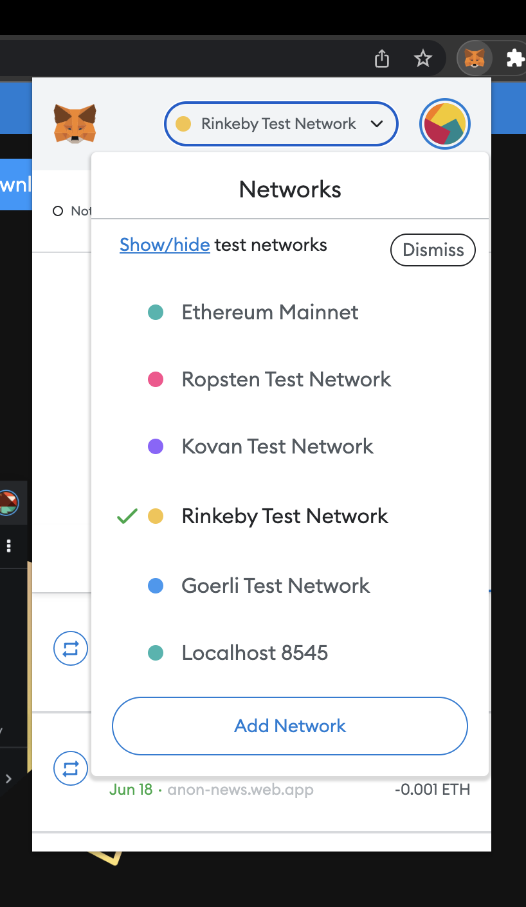

  
  <h1 align="center"><b>Voting-DAPP</b></h1>
  

  A decentralised voting tool
     
    <a href="https://decentralized-voting-dapp.web.app/"><strong>Hosted-Link »</strong></a>
     
     
  

Voting-DAPP is an open source initiative to users and the governing bodies hold a voting session in an anonymous and alteration free way. 
 
 

> NOTE: Voting-DAPP is under active development, most of the listed features are still experimental and subject to change.

 

# Motivation

The project aims to bring alteration/intervention free voting system to help the general population to choose their candidate democratically and in a transparent way.

# Architecture

- This project is using a Alchemy as a smart contract deployed node, the smart contract is written in Solidity.

- For the frontend the project is built on React Js with Material UI library.

# How to use

> Note: This project is currently on the testing chain of ethereum (Rinkeby)

- The user would need a metamask wallet (recommended) to access the web app. You can head over to this [link](https://metamask.io/) and download the extension for your browser. 
- Create a new account on the metamask wallet. And switch you wallet to Rinkeby Test Network.

- Copy your public address from your wallet and add some test ETH to it by heading over to this [link](https://faucets.chain.link/rinkeby) . Just paste your public address and you'll be good to go.

 

> Casting a vote in this web app will require an ethereum transaction.

 